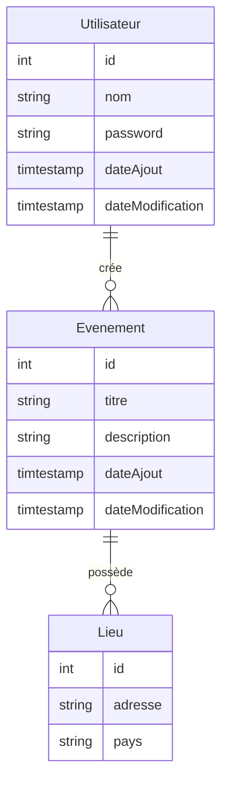

# GetTogether

## Équipe
**Nom d'oiseau de l'équipe**: Geai Bleu

**Participants**:
- DAO Gnim Gregoire
- Tsafack Joël Bertrand
- Niko Daryl Lucienne

**Mode de communication**: Teams/Whatsapp

**Personne contact**: Tsafack Joël Bertrand

## Type d'application
Application native mobile pour la gestion d'événements sociaux

## Description
GetTogether est une application qui permet de créer et gérer des événements sociaux. Les utilisateurs peuvent créer des événements, s'y abonner, échanger des messages dans des groupes de discussion liés à ces événements, et gérer leurs participations.

## Fonctionnalités

| Fonctionnalité | Description détaillée | Responsable |
|----------------|----------------------|-------------|
| Inscription | Permettre à l'utilisateur de créer un compte | Daryl |
| Connexion | Permettre à l'utilisateur de s'authentifier | Daryl |
| Déconnexion | Permettre à l'utilisateur de se déconnecter | Daryl |
| Suppression de compte | Permettre à l'utilisateur de supprimer son compte | Daryl |
| Liste des événements | Afficher tous les événements disponibles | Joel |
| Voir un événement | Vue détaillée d'un événement avec informations | Gnim |
| Modifier un événement | Permettre au créateur de mettre à jour les informations d'un événement | Gnim |
| Supprimer un événement | Permettre au créateur de supprimer un événement | Joel |
| S'abonner à un événement | S'inscrire à un événement existant | Joel |
| Quitter un événement | Se désabonner d'un événement | Gnim |
| Voir mon profil | Consulter les informations de son profil utilisateur | Daryl (pas prioritaire) |
| Modifier mon profil | Mettre à jour les informations de son profil | Daryl (pas prioritaire) |

## Répartition des tâches

### Interface utilisateur
| Page/Vue | Type | Responsable |
|----------|------|-------------|
| Connexion | Page complète | Daryl |
| Inscription | Page complète | Daryl |
| Liste des événements | Page complète, container | Gnim |
| Événement | Fragment, recycleView | Gnim |
| VoirÉvénement | Page complète | Joel |
| ModifierÉvénement | Page complète | Joel |

### Classes du modèle
| Classe | Responsable |
|--------|-------------|
| Événement | Joel |
| Lieu | Gnim |
| Utilisateur | Daryl |

### Tables de la base de données
| Table | Responsable |
|-------|-------------|
| Événement | Joel |
| Lieu | Joel |
| Utilisateur | Joel |
| ÉvénementUtilisateur | Joel |

## Aspects techniques

### Architecture
- Base de données locale avec SQLite
- Base de données distante avec MySQL ou MongoDB
- API backend avec Node.js & Express (ou SpringBoot)
- Synchronisation des données en mode hors-ligne (si possible)

### Organisation du projet
- Gestion via tickets sur GitLab
- Branches: main (releases) et dev (développement)

### Diagrammes prévus
- Diagramme de classes
- Modèle conceptuel de données (MCD) local et pour l'API
- Modèle logique de données (MLD) pour l'API

### Vues principales
- Page de chargement
- Pages de connexion et d'inscription
- Page de profil et modification de profil
- Liste des événements
- Vue détaillée d'un événement
- Page de modification d'événement
- Page de notifications
- Menu de navigation latéral
